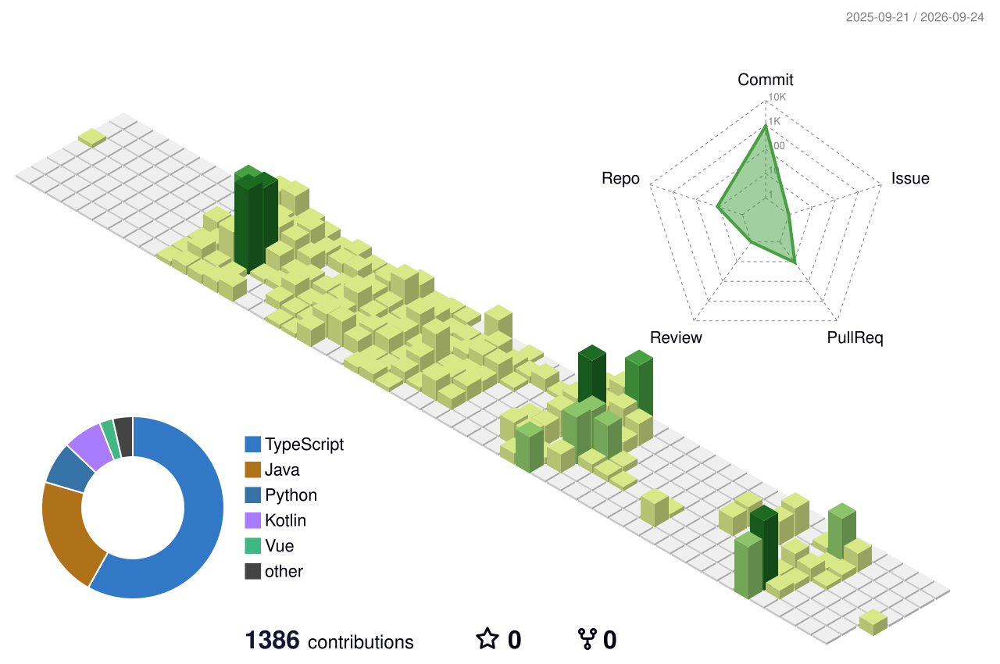

## 🛠 Skills

**Languages**  

  
  <!--  -->
  
  
  

**Development Stack**

  
  
    
  

**Collaboration & Tools**  

  
  
  
  

## 🚀 Projects

### [WISH](https://github.com/sehyeon262/WISH)
**소아암 환아를 위한 AI 일상회복 플랫폼**

- **Period**: 2026.04 - 2026.05 (8주)
- **Role**: AI
- **Tech Stack**: Python, FastAPI, PyTorch, MediaPipe, Whisper, RAG
- **Key Features**
  - AI 동작 채점 API 개발
  - Whisper STT와 RAG 기반 NPC 대화 기능 구현
  - 환아 데이터 수집 및 모델 성능 개선

---

### [DangDong](https://github.com/sehyeon262/DangDong)
**위치 기반 반려견 맞춤 산책 추천 서비스**

- **Period**: 2026.02 - 2026.04 (7주)
- **Role**: Frontend / Backend
- **Tech Stack**: Kotlin, Jetpack Compose, Spring Boot, Kakao Maps, WebSocket
- **Key Features**
  - 산책 세션 관리 및 위치 기록 API 개발
  - Kakao Map 기반 산책 지도 화면 구현
  - WebSocket 기반 실시간 채팅 기능 구현

---

### [Icethang](https://github.com/sehyeon262/Icethang)
**ADHD 아동 집중력 향상 AI 서비스**

- **Period**: 2026.01 - 2026.02 (6주)
- **Role**: Frontend
- **Tech Stack**: React Native, TypeScript, Expo, Redux Toolkit
- **Key Features**
  - React Native 기반 주요 화면 구현
  - 교사/학생용 학습 흐름 설계
  - 학습 기록 API 연동 및 UI 개선

---

### [TRAVUS](https://github.com/sehyeon262/TRAVUS)
**AI 기반 배리어프리 여행 경로 추천 서비스**

- **Period**: 2025.11 - 2025.12 (6주)
- **Role**: Frontend / Backend
- **Tech Stack**: Vue.js, Django REST Framework, OpenAI API, Pinia
- **Key Features**
  - 사용자 조건을 기반으로 접근성 친화 여행 경로 추천
  - 여행지 및 경로 정보 조회 기능 구현
  - SSAFY 14기 관통 프로젝트 최우수상 수상
 

## 📜 Certifications

- **빅데이터분석기사** | 한국데이터산업진흥원 | 2025.12.19  
- **정보처리기사** | 한국산업인력공단 | 2025.06.13  
- **SQLD** | 한국데이터산업진흥원 | 2025.04.04  
- **ADsP** | 한국데이터산업진흥원 | 2025.03.21

---

