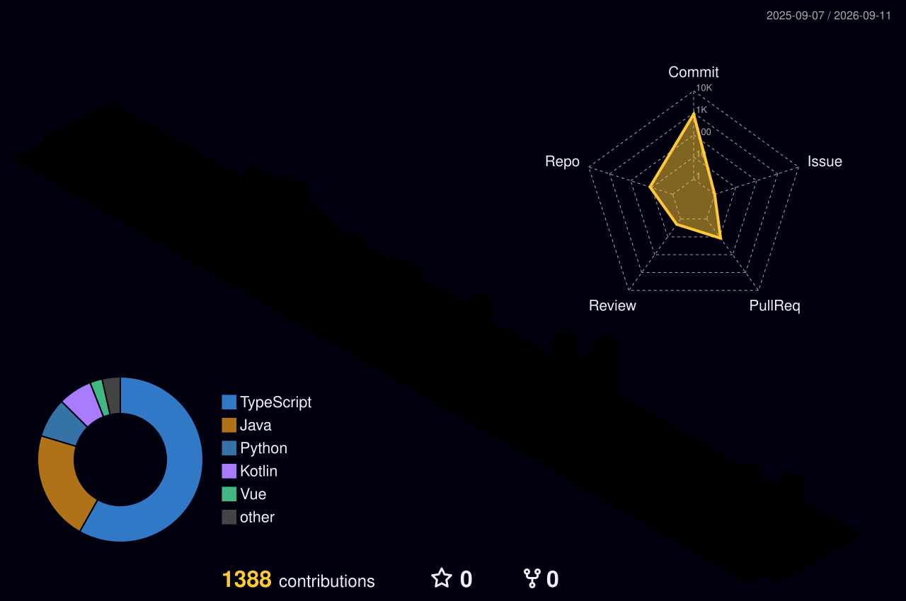

## 🛠 Tech Stack

### Languages

 
   
   
   
   
   

### Frontend

 
   
  <!--   -->
  <!--   -->
  
  

### Backend

 
   
   

### Database

 
   

### Collaboration & Tools

  
  
  
  

## 🏆 Awards

| Award | Project | Period | Description |
|------|------|------|------|
| SSAFY 14기 관통 프로젝트 최우수상 | [TRAVUS](https://github.com/sehyeon262/TRAVUS) | 2025.11 – 2025.12 | AI 기반 배리어프리 여행 경로 추천 |

## 🚀 Projects

| Category | Project | Period | Description |
|------|------|------|------|
| SSAFY 14기 공통 프로젝트 | [Icethang](https://github.com/sehyeon262/Icethang) | 2026.01 – 2026.02 | ADHD 아동 집중력 향상 AI 서비스 |
| SSAFY 14기 특화 프로젝트 | [DangDong](https://github.com/sehyeon262/DangDong) | 2026.02 – 2026.04 | 위치 기반 반려견 맞춤 산책 추천 서비스 |
| SSAFY 14기 자율 프로젝트 | [WISH](https://github.com/sehyeon262/WISH) | 2026.04 – 2026.05 | 소아암 환아를 위한 AI 일상회복 플랫폼 |

---

## 📜 Certifications

- **빅데이터분석기사** | 한국데이터산업진흥원 | 2025.12.19  
- **정보처리기사** | 한국산업인력공단 | 2025.06.13  
- **SQLD** | 한국데이터산업진흥원 | 2025.04.04  
- **ADsP** | 한국데이터산업진흥원 | 2025.03.21

---

